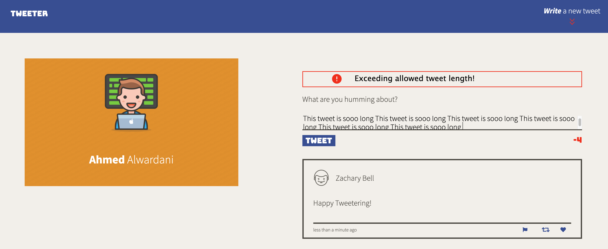

# Tweeter Project

Tweeter is a simple, single-page Twitter clone.

## Final Product

## 

## 

## 

## 

## 

## Dependencies

- Express
- Body Parser
- Chance
- Node 5.10.x or above

## Getting Started

1. Fork this repository, then clone your fork of this repository.
2. Install dependencies using the `npm install` command.
3. Start the web server using the `npm run local` command. The app will be served at <http://localhost:8080/>.
4. Go to <http://localhost:8080/> in your browser.
